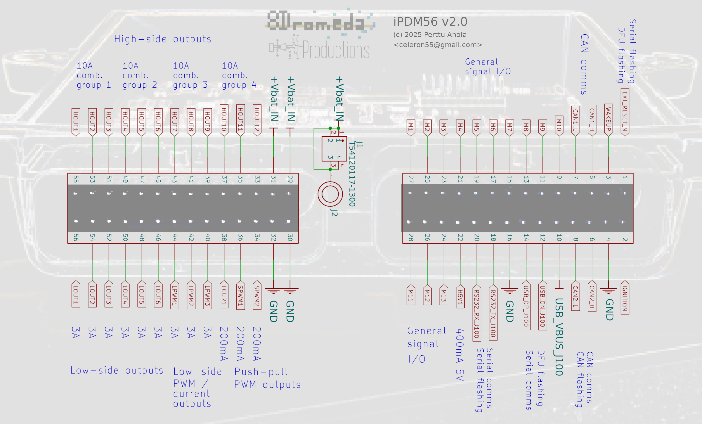
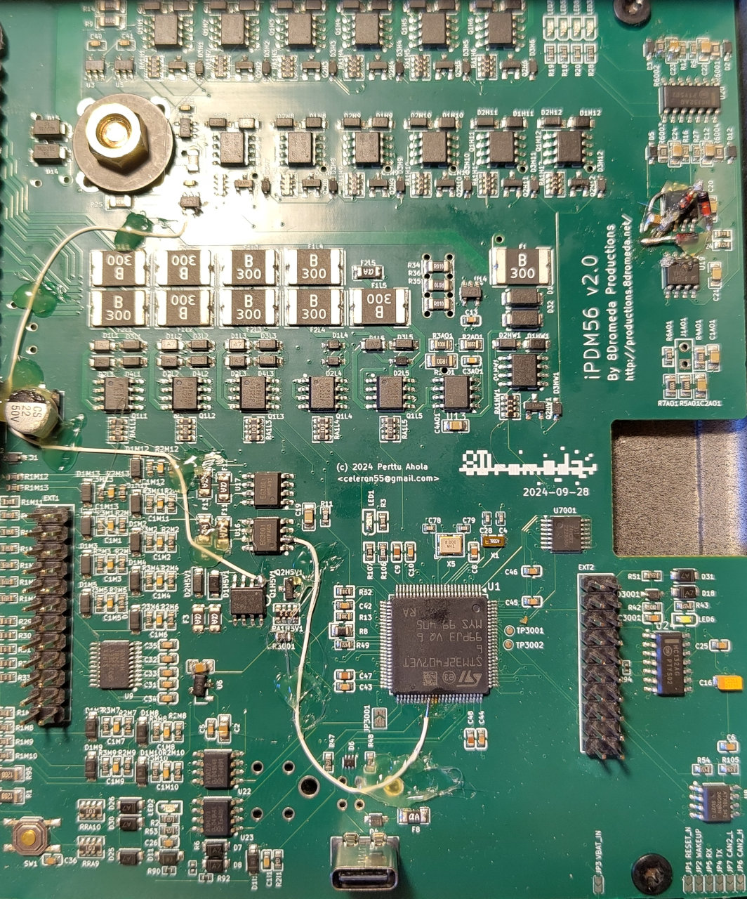

iPDM56 v2.0
===========

iPDM56 v2.0 flashing
--------------------

The board can be flashed and debugged by using SWD, which is available on the
EXT2 connector.

The board is designed to be flashed by using the ROM bootloader. You can read
about the behavior of the STM32 ROM bootloader e.g. in the STM32 application
note AN2606.

The ROM bootloder is reached by pulling the `EXT_RESET_N` line to ground for
about 3 seconds, until LED6 lights up, and then released. This resets the STM32
into the ROM bootloader.

The ROM bootloader is exited by pulling the `EXT_RESET_N` line to ground for
a short time (less than 1 second). This resets the STM32 into running the
program from flash.

The ROM bootloader supports these alternative flashing options:
- USB
    - Supported by e.g. dfu-util
- RS232
    - Supported by e.g. stm32flasher
    - The ui8d v2.0 display and telematics board can act as a convenient
      RS232 converter with a physical reset button for the `EXT_RESET_N` line
        - Note that currently doing this is quite flaky. I am not sure what's
          required to get stm32flasher to be happy, but if you spam stm32flasher
          while doing the long press `EXT_RESET_N` sequences, with any luck, it
          will succeed within a couple of attempts.
- CAN
    - To enable CAN flashing, bridge JP3001. This enables CAN flashing via CAN2.

iPDM56 v2.0 fixing the board
----------------------------

1. U6 (the 3.3V regulator) needs to be rotated so that (when looking at it so
   that there's one top pin and two bottom pins) the top pin moves in place of
   the right pin, and the right pin moves in place of the top pin. The remaining
   pin that was originally on the left has to be soldered to GND, which is
   handily found on the nearby capacitor and can be reached by adding a solder
   blob.

2. If you intend to use RS232 to flash the STM32:
    - You have three ALTERNATIVE fixes:
        1. Parallel or replace R3001 with a 1.0k resistor (originally 100k)
            - Downside: This increases the standby drain of the board by 3 mA on
              the 3.3V line, which corresponds to about 1.5 mA on the 12V supply
        2. Desolder RA1H5V1
            - Downside: The 5V external output pin won't provide 5V
        3. Replace RA1H5V1 with a 330k...470k 0603x4 resistor array
            - Downside: You need to acquire the replacement resistor array
            - Downside: I have not tested this fix in reality (yet)
    - R3001 is a pull-up resistor for the `PERIPHERALS_ENABLE` line, and 100k is
      too high due to bad resistance choices on the Q2H5V1 NPN transistor base
      and won't let the voltage on the `PERIPHERALS_ENABLE` line rise high
      enough to enable the U9 RS232 transceiver. Once the STM32 is up and
      running, it will keep the line high and RS232 will work regardless of this
      fix.

3. The PWMOUT1 and PWMOUT2 outputs are driven by EG3001 MOSFET gate drivers that
   seem quite fragile. The problem might be lack of continuous current
   capability, or it might be the fact that there's no ESD protection in the
   chips nor on the board. It's recommended to:
    - Add a zener diode and a 1nF capacitor in parallel on the output as ESD protection
    - Add a resistor in series with the output. As high of a resistance as
      possible given the use case
    - Report any successes and failures on GitHub or to celeron55@gmail.com

4. The C7 capacitor interferes with the enclosure. Make sure to cut or grind the
   cover so that there's room for the capacitor.

5. The HOUT current limiters are very strict at limiting to 10 A, no matter the
   length of the pulse. When the limit trips, the output will deactivate for
   about 1 second. This causes issues trying to power pumps and other things
   that take an initial pulse of current. The fix to this is difficult to make
   on the board, but for the sake of completeness, here it is:
    - For U18A, U18B, U19A and U19B (or just the ones you need >10A pulses on):
        - Cut the `*_CURRENT_MEAS` trace coming from U3, U5, U10 or U4 in such a
          way that you can still connect to both cut ends
        - Solder a 10k resistor over the cut
        - Solder 3 diodes in series, and parallel that with the 10k resistor
        - Solder a 10uF capacitor from the U18A/U19 side to ground
    - This increases the overcurrent protection limit to about 18 A for pulses
      of about 20 ms in length.
        - The upcoming iPDM56 v2.1 will hardware trip on 20 ms pulses at about
          21 A, but in order to do that it will have further changes.
    - These limiters are required to protect the MOSFETs and wiring. If you'd
      like to disable the limiters, you need to provide each high-side output
      with an external 7.5A fuse. (a 10A fuse will allow 10A for too long for
      the MOSFETs to survive)

6. SPWM1 and SPWM2 aren't connected from the STM32 to their corresponding output
   drivers due to net name mismatch (`SPWM1_LOGIC` vs. `SPWM1_CONTROL`)
    - SPWM1: Jumper from STM32 pin 60 to U16 pin 2
    - SPWM2: Jumper from STM32 pin 61 to U17 pin 2

Photo of a partially fixed board. You don't need to apply all bodges to make the
board useful for a given use case:

